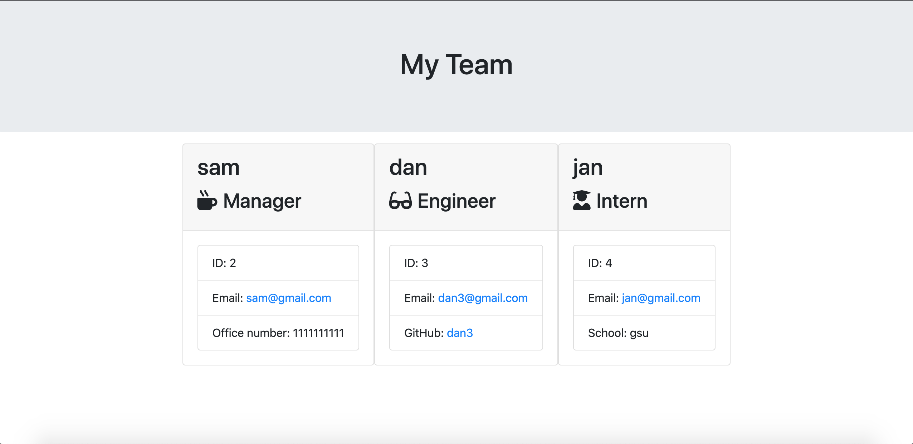

# Team Profile Generator

  [](https://opensource.org/licenses/MIT)

  ## Description
  This is an application that dynamically generates an html file that displays the information of a software developer team provided by the user. It uses node, async/await, recursion, bootstrap and OOP with javascript classes. It also uses jest for testing purposes.

  ## Table of Contents

  * [Installation](#installation)

  * [Usage](#usage)

  * [Visuals](#visuals)

  * [License](#license)

  * [Tests](#tests)

  * [Deployed Links](#deployed-links)

  * [Questions](#questions)


  ## Installation

  To install necessary dependencies, run the following command:

  ```
  npm i
  ```

  ## Usage

  make sure to run ```node index.js``` to start the app. Fill out all the questions as well as you can.

## Visuals
  

  ## License

  This project is licensed under the MIT license.

  ## Tests

  ```
  npm test
  ```
## Deployed Links

* [The URL of the GitHub repository.](https://github.com/simone188535/Team-Profile-Generator)
  ## Questions

  If you have any questions about the repo, open
  an issue or contact me directly at simone.anthony1@yahoo.com. You
  can find more of me at [simone188535](https://github.com/simone188535)
